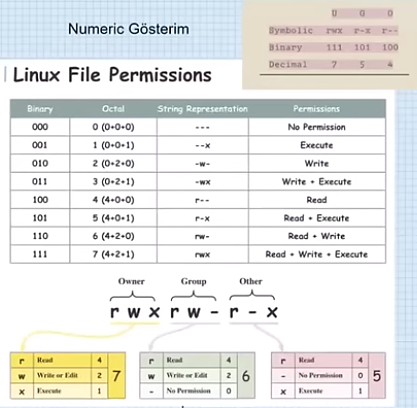

# DevOps Eğitimi

## Ders 1 (12.08.2026)
- AWS Hesap Açma
- AWS Üzerinde Instance Oluşturulması 
- Git Kurulumu
- VS Code Kurulumu
- GitHub Hesap Açma
- Virtual Box Kullanımı (1:12:31)
- osboxes.org Kullanımı (1:19:00) Virtual Box İçin Linux İşletim Sistemi ISO Dosyaları
    - username: osboxes
    - password: osboxes.org
- OS nedir? (1:34:00)
    - Uygulamalar
    - Kullanıcı Arayüzü
    - Kernel
- Kernel nedir? (1:40:00): Uygulama donanımı kullanacaksa Kernel' a System Call gönderir.

- Linux Distros (1:58:00)
    - Paketleme yöntemleri farklı. 
    - Debian ailesi deb kullanıyor.
    - Slackware ve RedHat rpm kullanıyor. 

- Kişisel kullanım için Ubuntu öneriliyor.
- Enterprise kullanım için support ihtiyacı varsa RedHat öneriliyor.
- Enterprise kullanım için support ihtiyacı yoksa CentOS, RockyLinux veya Fedora öneriliyor.
- Virtualization ve Hyper-V (2:10:00)
- 32 ve 64 bit nedir? 

| Özellik | 32-bit (x86) | 64-bit (x64) |
| --- | --- | --- |
| **İşlemci Kayıtçısı (Register)** | 32 bit genişliğinde veri işler | 64 bit genişliğinde veri işler |
| **Maksimum RAM Desteği** | Teorik olarak 4 GB | Teorik olarak 16 Exabyte |
| **Performans** | Daha az veri yolu | Devasa veri işleme kapasitesi |
| **Yazılım Uyumluluğu** | Sadece 32-bit programlar | Hem 32-bit hem 64-bit programlar |

- x86, x64 ev ARM64 ne demektir.?    
    x86, x64 ve ARM64, bilgisayarların, telefonların ve diğer elektronik cihazların işlemcilerinin (CPU) kullandığı komut seti mimarileridir. İşlemcinin yazılımlarla nasıl iletişim kuracağını ve komutları nasıl işleyeceğini belirlerler.
    - x86 (32-bit Mimari)
        - Ne Demek? Intel'in 1978'de geliştirdiği 8086 işlemci ailesine dayanan ve yıllar içinde 32-bit olarak standartlaşan mimaridir.
        - Özellikleri: Adını işlemci serilerinin sonundaki "86" ekinden alır (örn. 80386, 486). Günümüzde masaüstü dünyasında neredeyse tamamen yerini 64-bit sistemlere bırakmıştır.
        - Kullanım Alanı: Eski bilgisayarlar ve 32-bit işletim sistemleri.
    - x64 (64-bit Mimari - x86_64 / AMD64)
        - Ne Demek? x86 mimarisinin 64-bit versiyona genişletilmiş halidir. İlk olarak AMD tarafından geliştirildiği için AMD64, daha sonra endüstri standardı olduğu için genellikle x64 olarak adlandırılmıştır.
       - Özellikleri: Geriye dönük uyumluluğa sahiptir; yani 64-bitlik bir işlemci üzerinde hem eski 32-bit (x86) programları hem de modern 64-bit programları çalıştırabilirsiniz. Devasa RAM kapasitelerini ve yüksek veri işlemeyi destekler.
        - Kullanım Alanı: Günümüzdeki Intel ve AMD işlemcili masaüstü bilgisayarlar, dizüstü bilgisayarlar ve sunucular.
    - ARM64 (AArch64)
        - Ne Demek? ARM Holdings tarafından geliştirilen, özellikle enerji verimliliği ve düşük güç tüketimi odaklı tasarlanmış 64-bit bir mimaridir.
        - Özellikleri: Akıllı telefonlar ve tabletlerde kullanılan ARM mimarisinin 64-bit sürümüdür. Son yıllarda sadece mobil cihazlarda değil, bilgisayarlarda da (Apple'ın M serisi işlemcileri, Snapdragon X Elite işlemcili yeni nesil dizüstü bilgisayarlar) yüksek performans ve uzun pil ömrü nedeniyle yoğun olarak kullanılmaktadır.
        - Kullanım Alanı: Akıllı telefonlar, tabletler, akıllı saatler ve modern ARM tabanlı dizüstü bilgisayarlar (Apple Mac'ler, bazı Windows PC'ler).

## Ders 2 (13.08.2026)
- Shell ve Terminal (21:39)
    - Terminal, kullanıcı ile işletim sistemi arasında görsel bir köprü kuran fiziksel bir cihaz veya günümüzdeki adıyla bir terminal emülatörüdür (örneğin macOS'teki Terminal veya Linux'teki GNOME Terminal); temel görevi klavyeden girilen karakterleri toplamak, ekranda göstermek ve arka plandaki yazılıma iletmektir. Buna karşılık shell (kabuk) ise, işletim sisteminin çekirdeğiyle doğrudan iletişim kurarak komutlarınızı yorumlayan bir komut yorumlayıcısıdır (örneğin Bash, Zsh veya PowerShell). Özetle; terminal klavyeden basılan tuşları ekrana yansıtıp girdi/çıktı işlemlerini yöneten pencere veya arayüzü oluştururken, shell bu pencereye yazdığınız komutları anlamlandırıp işletim sisteminde çalıştıran ve kendi betik dili bulunan beyin görevini üstlenir.
- `ec2-user@ip-72-31-1-144 ~` (user@bilgisayar_adi mevcut konum)
- `cd /` (Roota gider.)
- **Binary Dosya**: Verilerin doğrudan bilgisayarın anlayacağı şekilde ikili sistem (0 ve 1'ler) formatında saklandığı, düz metin editörleriyle (Notepad gibi) açıldığında anlaşılmaz karakterler gösteren dosyalardır. Resimler, müzikler,çalıştırılabilir programlar (.exe vb.) ve sıkıştırılmış dosyalar bu türe girer.
- `rmdir` (Boş klaösürü silmek için kullanılır.)
- `rm -rf` (Dolu klasörü silmek için kullanılır.)
- `ls --help` (Komut için yardım dosyalarını açar.)
- `man ls` (Komut için yardım dosyalarını açar. Çıkmak için q)
- `cp deneme1 deneme2` (deneem1 dosya içeriğini deneme2 dosyasına kopyalar.)
- `mv -i` dosyaadi1 dosyaadi2 (İNteraktif modda dosya işlemi yapar.)

| Dizin | Adı / Anlamı | Özel ve Akılda Kalıcı Açıklaması |
| --- | --- | --- |
| **`/`** | Kök (Root) Dizin | Bütün sistemin doğduğu ve diğer her şeyin dallandığı **evrenin başlangıç noktasıdır**. |
| **`/bin`** | Binaries (Komutlar) | Sistem yöneticisinin ve kullanıcıların sistemin açılması veya kurtarılması için ihtiyaç duyduğu **temel komutları** (ls, cp, bash vb.) saklar. |
| **`/boot`** | Boot (Açılış) Dosyaları | Bilgisayarın açılmasını sağlayan çekirdek (**kernel**) ve önyükleyici (**GRUB**) dosyalarının evidir. |
| **`/dev`** | Devices (Donanımlar) | Sabit diskler, klavye ve USB bellek gibi **tüm fiziksel donanımların birer dosya olarak temsil edildiği** özel alandır. |
| **`/etc`** | Editable Text Configurations (Ayarlar) | Sistemdeki tüm programların ve kullanıcıların **ayar dosyalarının (konfigürasyonların)** toplandığı metin merkezidir. |
| **`/home`** | Ev Sahipleri (Kullanıcılar) | Sizin ve diğer kullanıcıların **kişisel dosyalarının, masaüstünün ve indirmelerinin** tutulduğu özel yaşam alanıdır. |
| **`/lib`** | Libraries (Kütüphaneler) | `/bin` ve `/sbin` içindeki programların çalışmak için ihtiyaç duyduğu **ortak kod kütüphanelerinin** bulunduğu yerdir. |
| **`/media`** | Medya (Çıkarılabilir Aygıtlar) | Takıp çıkardığınız **USB belleklerin, harici disklerin veya CD'lerin** otomatik olarak bağlandığı (mount edildiği) kapıdır. |
| **`/mnt`** | Mount (Geçici Bağlantılar) | Sistem yöneticilerinin **harici dosya sistemlerini veya diskleri geçici olarak bağlamak** için kullandığı özel istasyondur. |
| **`/opt`** | Optional (İsteğe Bağlı) | Standart paket yöneticisiyle gelmeyen, **üçüncü parti büyük yazılımların** (Google Chrome, Zoom vb.) kurulduğu yerdir. |
| **`/proc`** | Process (Sanal Süreçler) | Fiziksel diskte yer almayan, **RAM üzerinde yaşayan** ve anlık sistem/donanım durumunu gösteren sanal bilgi panosudur. |
| **`/root`** | Root'un Evi | Sistemdeki tüm yetkilere sahip süper kullanıcının (**root**) kendi kişisel ev dizinidir. |
| **`/run`** | Runtime (Çalışma Zamanı) | Sistem açıldığından beri üretilen **geçici çalışma zamanı verilerinin ve servis kilitlerinin** (PID dosyaları vb.) tutulduğu alandır. |
| **`/sbin`** | System Binaries (Yönetici Komutları) | Sadece sistem yöneticisinin (**root**) çalıştırabileceği ağ ve disk yönetim komutlarını (fdisk, reboot vb.) barındırır. |
| **`/srv`** | Service (Servis Verileri) | Bu sunucu üzerinden dış dünyaya sunulan **web, FTP veya veritabanı verilerinin** saklandığı merkezdir. |
| **`/sys`** | System (Sistem Bilgileri) | Çekirdeğin donanımla nasıl konuştuğunu yöneten, **donanım ayarlarını anlık değiştirmeye yarayan** sanal arayüzdür. |
| **`/tmp`** | Temporary (Geçici Dosyalar) | Programların işleri bitene kadar kullandığı, **bilgisayar yeniden başladığında otomatik silinen** hurdalıktır. |
| **`/usr`** | Unix System Resources (Kullanıcı Kaynakları) | Günlük kullandığınız tüm büyük programların (Python, Git vb.), kütüphanelerin ve belgelerin saklandığı **en büyük sistem deposudur**. |
| **`/var`** | Variable (Değişken Veriler) | Sürekli büyüyen ve değişen **günlük kayıtlarının (loglar), veritabanlarının ve e-postaların** biriktiği yerdir. |

- `echo $PATH`
- `which komut`
- `export PATH=$PATH:/home/ec2-user/hp/bin` (Makine restart edilince sıfırlanır.)
- Engellemek için;
    - `echo 'export PATH=$PATH:/home/ec2-user/hp/bin' >> ~/.zshrc`
    - `source ~/.zshrc`

## Ders 3 (13-14.08.2026)
- Soft Link (05:43) (Asıl dosya silinirse soft  link silinmez.)
    - `ln -s /home/ec2-user/username/hedef.txt linkimiz.txt`
- Hard Link (Asıl dosya silinirse hard link silinir.)
    - `ln /home/ec2-user/username/hedef.txt linkimiz.txt`   
- `unlink linkimiz.txt` (Soft linkin silinmesdir.)
- `rm linkimiz.txt` (Sadece hard linki siler. Hedef dosyayı silmez.)
- `find /etc -name conf*`
- `find /etc -iname conf* -ls` (Case sensitive arama yapar.)
    - *6140202344      0 drwxr-xr-x   2 root     root            0 Apr 10 07:18 /snap/core24/1643/usr/share/terminfo/a*
    - *3759937345      0 drwxr-xr-x   2 root     root            0 Apr 10 15:14 /snap/core20/2866/usr/lib/terminfo/a*
- `find . -mtime +10` (10 günden eski dosyaları bular.)
- `find . -size +1M` (Dosya boyutuna göre arama yapar.)
- `fİnd . -type d -newer hedef.txt` (hedef.txt' den daha yeni dosyaları bulur.)
- `less dosya_ismi`
- `head -2 dosya_ismi`
- `tail -2 dosya_ismi`
- `tail -f dosya_ismi`
- `find . -iname config -exec cat {} \;`
- `vim dosya_ismi` (to show line numbers: `ESC + :set nu + Enter` to quit: `ESC + :wq + Enter`)
- `nano dosya_ismi`
- `diff dosya_ismi dosya_ismi`
- `vimdiff dosya_ismi dosya_ismi` (vim üzerinde gösterir.)
- `sdiff dosya_ismi dosya_ismi` (Shell üzerinde gösterir.)
- `grep -i özgür dosya_ismi` (Case sensitive arama yapar.)
- `grep -ic özgür dosya_ismi` (Case sensitive arama yapar bulunduğu satırları gösterir.)
- `grep -iv özgür dosya_ismi` (Case sensitive arama yapar bulunmadığı satırları gösterir.)
- `grep -n özgür dosya_ismi` (Bulunduğu satır numarası ve sonucu  gösterir.)
- Dosya İzinleri (1:23:00) 

- `chmod g-w deneme.sh`
- `chmod 755 deneme.sh`
- `chmod o=r deneme.sh` (Explicit hak verir. Diğer haklar aynı kalır.)
- `umask` `umask 000` (Kullanıcılara varsayılan izin atamalarını atar ve gösterir.)
- `cat /etc/default/useradd` (Yeni eklenen kullanıcıların varsayılan izinlerini gösterir.)
- `cat /etc/passwd` (Yeni eklenen kullanıcıları ve parolalarını gösterir.)
- `sudo useradd tuncayyaylali` `sudo passwd tuncayyaylali` `su tuncayyaylali`
- `sudo` komutunu kullanabilmek için kullanıcının `sudoers` dosyasına eklenmiş olması gerekmektedir. 
- `sudo su` (Root' a geçer.)
- `groups` 
    - *hp adm cdrom sudo dip plugdev users docker*
- `groups hp`
- `sudo usermod -a -G ec2-user hp`
- `sudo usermod -aG wheel tuncayyaylali` (Kullanıcı otomatik olarak sudoers' a eklenir.)
- SUID `sudo chmod u+s dosya_adi` (Normal bir kullanıcının, geçici olarak dosyanın sahibinin yetkileriyle (genellikle root) program çalıştırmasını sağlar.)
    - `sudo chmod u-s dosya_adi`
- SGID `sudo chmod g+s dizin_adi` (Bir dizine uygulandığında, o dizin içinde oluşturulan yeni dosyaların grup sahibinin oluşturan kişinin bireysel grubu değil, üst dizinin grup sahibi olmasını sağlar. Ortak çalışma alanları için idealdir.)
    - `sudo chmod g-s dizin_adi`
- Sitcky Bit `sudo chmod +t dizin_adi` (Herkese yazma izni verilmiş ortak dizinlerde (örn. /tmp), bir dosyayı sadece o dosyanın sahibinin, dizin sahibinin veya root'un silebilmesini kısıtlayarak güvenliği sağlar.)
    - `sudo chmod -t dizin_adi`

## Ders 3 (14-15.08.2026)
- `cat /etc/group` (Tüm grupları listeler.)
    - Grup Adı:Parola:Group ID
    - Parole için `cat /etc/shadow`
- `usermod -aG group_name user_name` (Kullanıcıyı gruba ekler.) 
- `chgrp osman deneme.txt` (deneme.txt dosyasının grubu osman olarak değiştirildi.)
- `chownn root deneme.txt` (deneme.txt dosyasının sahibi root olur.)
- stdin, stdout & stderr (20:00)
    - `echo "Deneme" > deneme.txt` (Yazar.)
    - `echo "Deneme" >> deneme.txt` (Append eder.)
    - `sort < cat deneme.txt`
    - `cat deneme.txt | sort | head -2 >> deneme.txt` 
    - `echo "deneme" ; cat deneme.txt ; echo "deneme"` \
        *deneme \
        Deneme Deneme \
        deneme*
    - `echo "osman" && echo "osman"` (Sol hata vermez ise sağ çalışır.)
    - `echo "osman" || echo "osman"` (Sol hata verirse sağ çalışır.)
- `tar` Uygulaması (47:00)
    - `tar -cf gonder.tar dosyalar/` (Arşiv dosyası hazırlar.)
    - `tar -tf gonder.tar` (Arşiv içerisine bakar.)
    - `tar -xf ../gonder.tar ` (Arşivi açar.)
- `du -h dosya_ismi` (Disk kullanımını gösterir.)
- `gzip` Uygulaması (55:00)
    - `gzip gonder.tar` (Dosyayı sıkıştırır.)
    - `du -h gonder.tar.gz`
    - `gunzip gonder.tar.gz` (Sıkıştırılmış dosyaları açar.)
    - `tar -zcf gonder.tgz dosyalar/` (Dosyaları hem sıkıştırır hem arşivler.)
    - `tar -zxf gonder.tgz dosyalar/` (Sıkıştırılmış ve arşivlenmiş dosyaları açar.)
 - `alias` Uygulaması (1:02:00)
    - `alias bd="echo 'Bu bir denemedir.'"`
